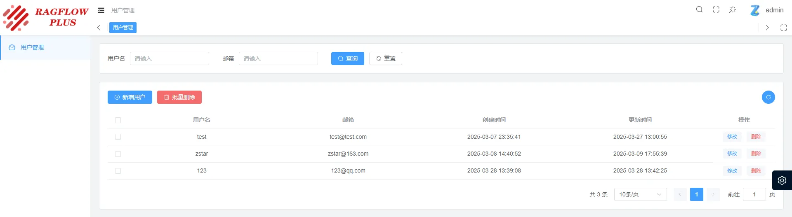

<div align="center">
  
</div>

## 项目介绍

Ragflow-Plus 是一个基于 Ragflow 的开源项目，主旨是在不影响 Ragflow 原有功能的基础上，提供一些新的功能，以解决实际应用中的一些痛点。

## 新增功能介绍

### 一. 用户后台管理系统

移除原登陆页用户注册的通道，搭建用户后台管理系统，包含以下功能：

- 用户管理：新增用户、删除用户
  特点：新建用户时，新用户会自动加入创建时间最早用户的团队，并默认采取和最早用户相同的模型配置。

- 团队管理：新增团队、编辑团队、团队成员管理

- 用户配置管理：查看修改用户的模型参数配置

- 文件管理：上传文件、删除文件、查询文件

- 知识库管理：新增知识库、编辑知识库、删除知识库、知识库列表查看、文件解析

### 二. 文档撰写功能

前台系统进一步调整样式，新增文档撰写全新的交互方式，支持直接导出为 Word 文档。

## 使用方式

#### 1. 使用Docker Compose运行

在项目根目录下执行

```bash
docker compose -f docker/docker-compose.yml up -d
```
访问地址：`服务器ip:80`，进入到前台界面

访问地址：`服务器ip:8888`，进入到后台管理界面


#### 2. 源码运行(mysql、minio、es等组件仍需docker启动)

也可以通过下面的方式单独运行管理系统

启动后端：

1.打开后端程序`management/server`，安装依赖

```bash
pip install -r requirements.txt
```

2.启动后端

```bash
python app.py
```

启动前端：

1.打开前端程序`management\web`，安装依赖
```bash
pnpm i
```

2.启动前端程序
```bash
pnpm dev
```

浏览器访问启动后的地址，即可进入系统。

<div align="center">
  
</div>


## 交流群
如果有其它需求或问题建议，可加入交流群进行讨论。

由于群聊超过200人，无法通过扫码加入，如需加群，加我微信zstar1003，备注"加群"即可。

## 鸣谢

本项目基于以下开源项目开发：

- [ragflow](https://github.com/infiniflow/ragflow)

- [v3-admin-vite](https://github.com/un-pany/v3-admin-vite)

## 更新信息获取

目前该项目仍在持续更新中，更新日志会在我的微信公众号[我有一计]上发布，欢迎关注。

## Star History

