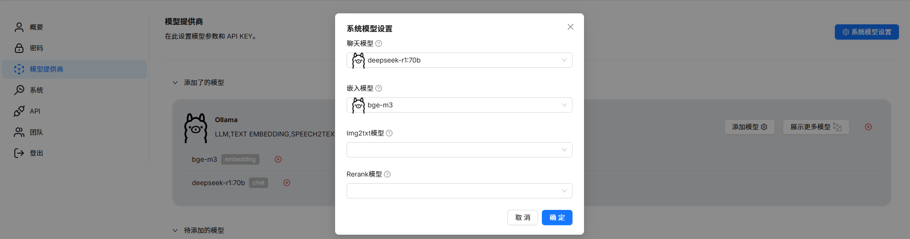
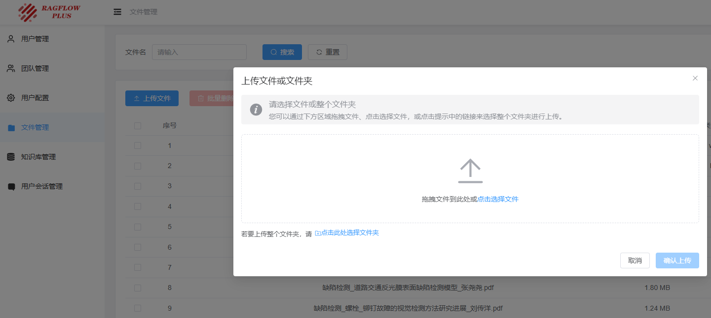
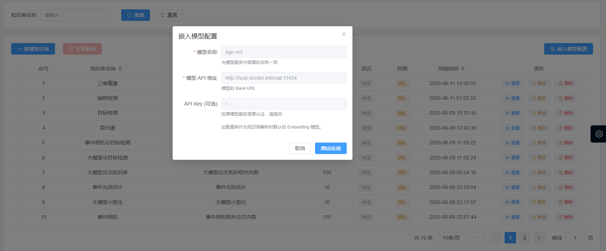
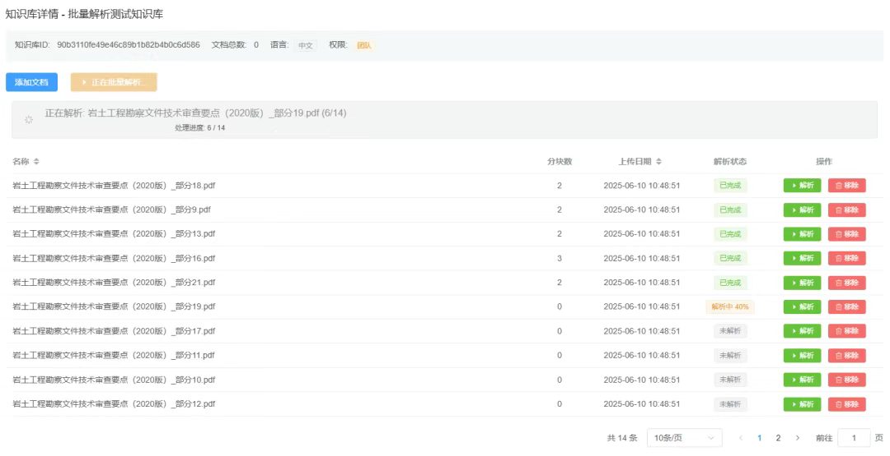
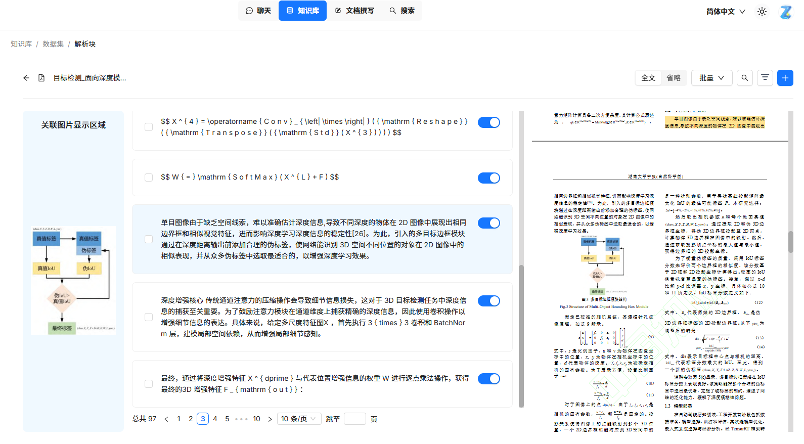
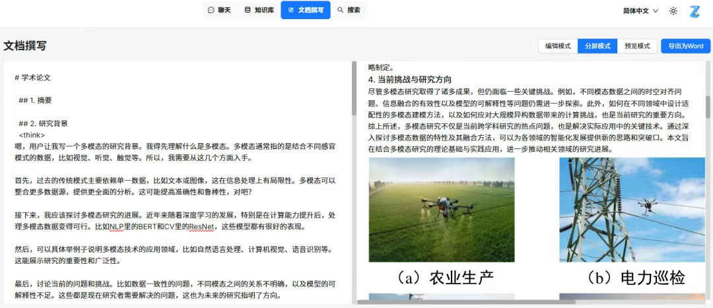

# 快速开始

## 1. 适合人群

Ragflow-Plus 适合以下应用场景：

- 高校/企业等事业单位团队，需要构建一系列中心知识库通过在线API，增强现有大模型的回答效果。

- 本地部署大模型，通过构建局域网进行内部关联访问。

考虑到实际的落地需要，本项目移除了Agent相关模块，并将文件管理、文件解析等操作移动到后台进行。

## 2. 硬件要求

建议部署硬件资源需满足以下配置：

- CPU ≥ 4 cores (x86);
- RAM ≥ 16 GB;
- Disk ≥ 50 GB;
- Docker ≥ 24.0.0 & Docker Compose ≥ v2.26.1.

## 3. 开始部署

推荐采用docker进行部署。

### 1. 克隆项目代码

```bash
git clone https://github.com/zstar1003/ragflow-plus.git
```

### 2. 拉取镜像并启动

进入项目根目录，执行：

```bash
docker compose -f docker/docker-compose.yml up -d
```

如果拉取镜像失败，建议通过配置以下docker镜像源，以加速拉取镜像速度。

```bash
"registry-mirrors": [
    "https://docker.m.daocloud.io",
    "https://docker.imgdb.de",
    "https://docker-0.unsee.tech",
    "https://docker.hlmirror.com",
    "https://docker.1ms.run",
    "https://func.ink",
    "https://lispy.org",
    "https://docker.xiaogenban1993.com"
]
```

也可以直接下载网盘打包好的镜像资源文件：

网盘地址: [https://pan.baidu.com/s/1fC7dzuD0WO3FaEARjJNoMg?pwd=8888](https://pan.baidu.com/s/1fC7dzuD0WO3FaEARjJNoMg?pwd=8888) 提取码: 8888 

使用如下命令加载安装镜像：
```bash
docker load -i ragflowplus-images.tar
```

### 3. 注册新用户

浏览器输入：`http://localhost:8888`，登陆后台管理系统。

初始登陆账号为: `admin`, 密码为: `12345678`

在用户管理菜单中，新建新用户。

考虑到后续嵌入模型配置、知识库创建的身份均是以初始用户的身份执行，推荐将此用户定义为管理员用户，即采用(admin/lab)公共账户的命名方式，而非具体用户。


### 4. 初始用户模型配置

创建完初始用户后，在创建下一用户前，建议先在前台配置初始用户的模型设置。

浏览器输入：`http://localhost:80`，登陆前台用户系统。



需要配置embedding模型和chat模型。

embedding模型当前仅支持*bge-m3*，以ollama平台为例：

首先通过ollama拉取bge-m3模型：

```bash
ollama pull bge-m3:latest
```

前台配置时，模型名称设置为`bge-m3`，url地址设置为`http://host.docker.internal:11434`。

如果想通过API在线进行配置，推荐采用硅基流动平台，bge-m3模型可免费调用。

平台地址：https://cloud.siliconflow.cn/i/bjDoFhPf

需要在平台中获取API KEY，并将其输入到模型选择菜单中。

chat模型配置同理。

### 5. 创建其它用户

配置好初始用户，回到后台，可继续创建其它用户。

其它新用户会使用和初始用户相同的模型配置，并自动加入新用户的团队，加入团队后，可共享知识库信息。

可通过团队管理菜单，可对用户的团队所属情况进行进一步添加和移除。


### 6. 上传文件

在后台文件管理菜单中，可以上传文件或文件夹。



### 7. 知识库构建和解析

在后台知识库管理菜单中，可以进行知识库的创建和文档添加与解析。

在解析前，建议先进行嵌入模型的配置测试。



该界面会自动读取初始用户最新的嵌入模型配置信息(注：是最后添加的模型配置而非系统模型配置中的模型信息)

测试连接通过，可进行下一步文件解析，支持文件单独解析和批量文件解析两种方式。



解析的日志信息可在`docker\ragflow-plus-logs\parser.log`进行输出。

支持解析的文件类型包括：pdf，doc，docx，pptx，xlsx，csv，txt，md，jpg，png。

### 8. 解析内容查看

解析完成后，可到前台查看具体的解析块信息，并查询其所关联图片。



### 9. 问答模式

在前台问答模块，创建助理后，可进行问答交互，输出文本信息和文本块关联的图像信息。


### 10. 文档撰写模式

在前台文档撰写模块，可选择指定知识库，根据指定模板，进行文档写作输出，结果可导出下载为Word文档。


